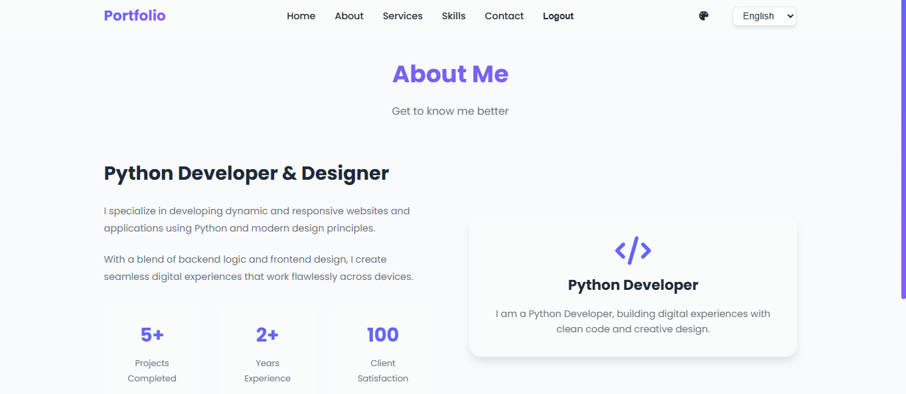
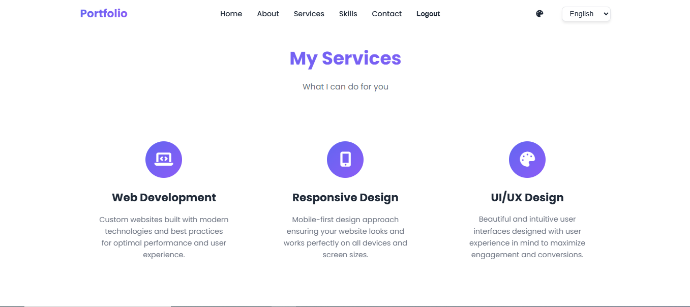
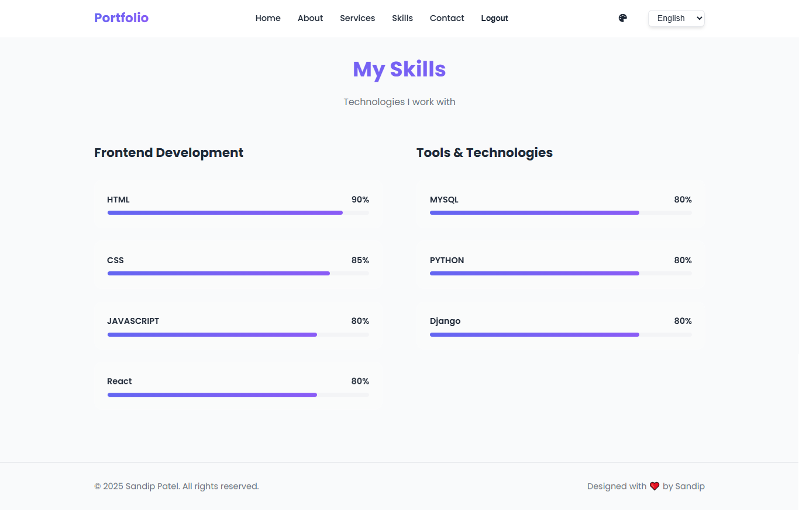
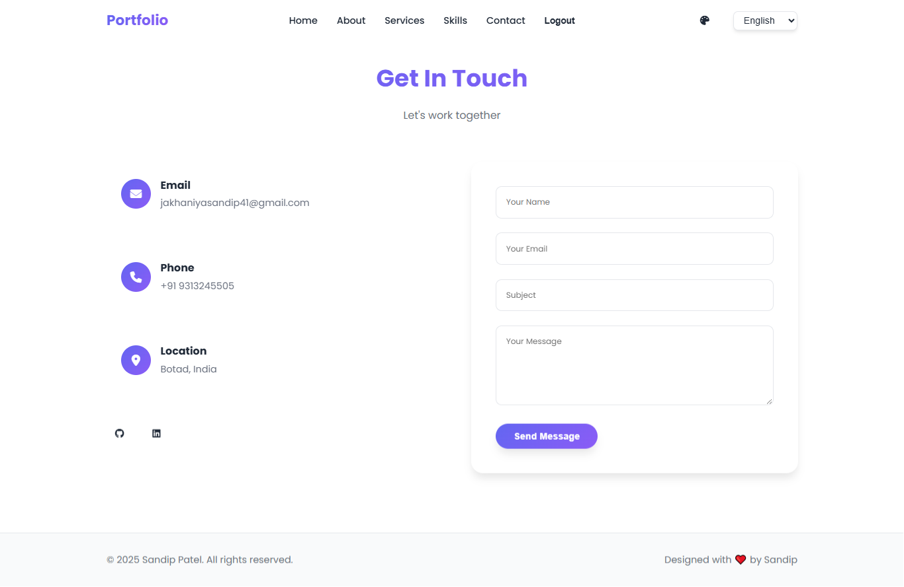
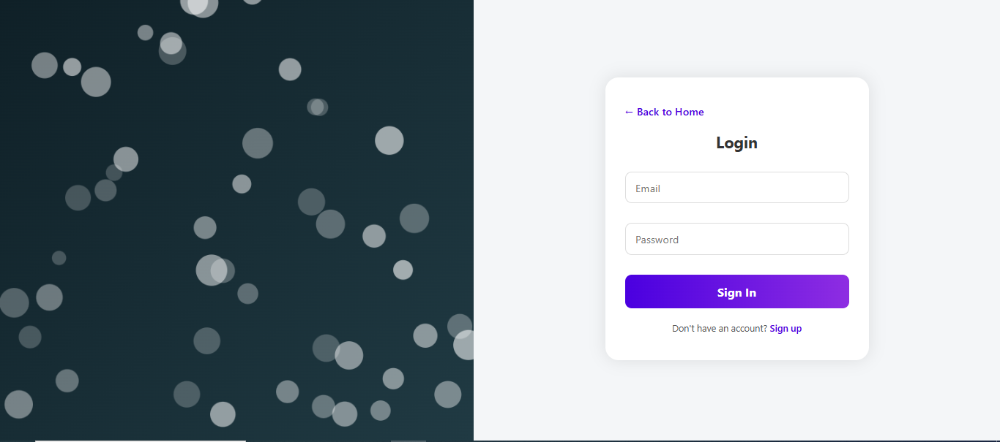
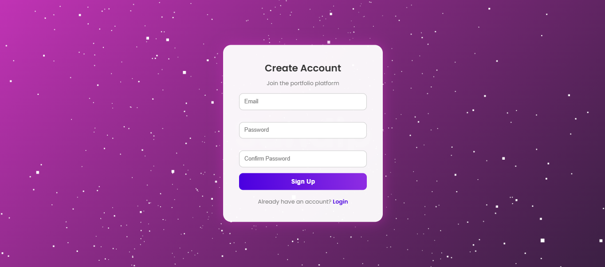

## 🌀 Django Project with Docker Setup

This is a Django-based web application fully containerized using Docker. It includes a working Docker setup, SQLite database, and is easy to deploy on local or production environments.

---

## 🧱 Project Structure

```
project-root/
|
├── Dockerfile  
├── docker-compose.yml  
├── requirements.txt  
|
├── my_portfoliowebsite/  
│   ├── manage.py  
│   ├── db.sqlite3  
│   ├── my_portfoliowebsite/  
│   │   ├── settings.py  
│   │   ├── urls.py  
│   │   └── wsgi.py
│   └── my_website/
│       ├── models.py
│       ├── urls.py
│       ├── views.py
│       ├── templates/
│       └── static/
|
├── media/  
│   ├── hero_images/  
│   ├── photos/  
│   └── product_images/
|
└── README.md
```

---

## 🐳 Docker Setup

### Dockerfile

```dockerfile
FROM python:3.11-slim

ENV PYTHONDONTWRITEBYTECODE=1
ENV PYTHONUNBUFFERED=1

WORKDIR /app

COPY requirements.txt /app/
RUN pip install --no-cache-dir -r /app/requirements.txt

COPY my_portfoliowebsite /app/my_portfoliowebsite

WORKDIR /app/my_portfoliowebsite

CMD ["python", "manage.py", "runserver", "0.0.0.0:8000"]
```

### docker-compose.yml

```yaml
version: '3.9'
services:
  web:
    build: .
    ports:
      - "8000:8000"
    volumes:
      - .:/app
    working_dir: /app/my_portfoliowebsite
    command: python manage.py runserver 0.0.0.0:8000
```

### requirements.txt

```text
Django>=4.2
```

---

## 🚀 Run with Docker

```bash
# Build the image
docker-compose build

# Run the container
docker-compose up

# Visit in browser
# http://localhost:8000
```

---

## 💻 Run Without Docker (Local Setup)

```bash
python -m venv venv
venv\Scripts\activate  # Windows
# source venv/bin/activate  # Linux/Mac

pip install -r requirements.txt
python my_portfoliowebsite/manage.py migrate
python my_portfoliowebsite/manage.py runserver
```

---

## 📂 Static & Media Setup (Django settings)

```python
MEDIA_URL = '/media/'
MEDIA_ROOT = os.path.join(BASE_DIR, 'media')

STATIC_URL = '/static/'
STATIC_ROOT = os.path.join(BASE_DIR, 'static')
```

Ensure your `urls.py` serves media in development:

```python
from django.conf import settings
from django.conf.urls.static import static

urlpatterns = [
    # ... your routes ...
] + static(settings.MEDIA_URL, document_root=settings.MEDIA_ROOT)
```

---

## 🌐 Live Demo

[Visit the Live Website](https://sandip-website-8jdn.onrender.com/)

---

## ✨ Sign Up Page

Create an account on the live site to explore the authenticated sections.

---

## 📸 Screenshots

> Below are previews of key pages from the site.

### Home


### About


### Services


### Skills


### Contact


### Login


### Sign Up


---

## 📄 License

This project is released under the MIT License. You are free to use, modify, and distribute it with attribution.


